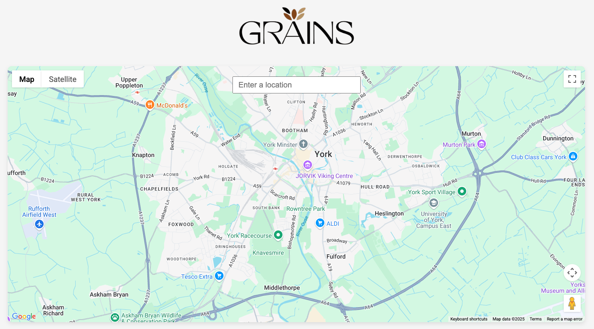
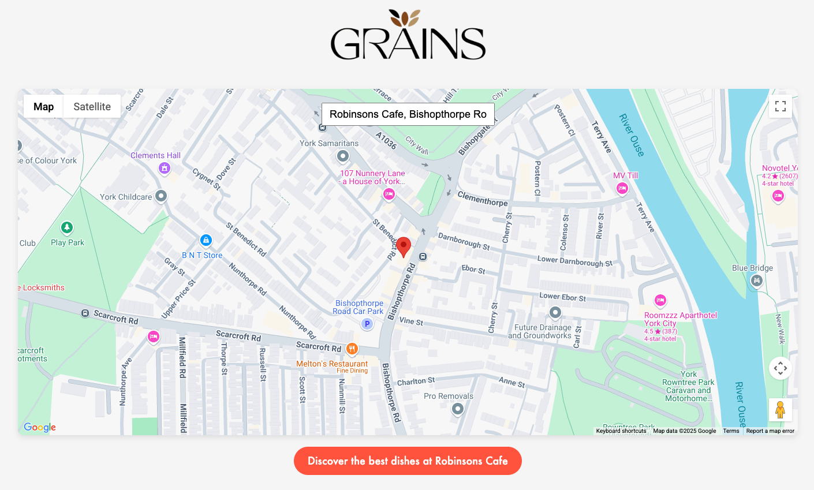
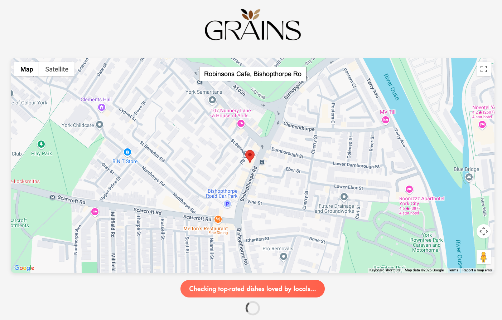
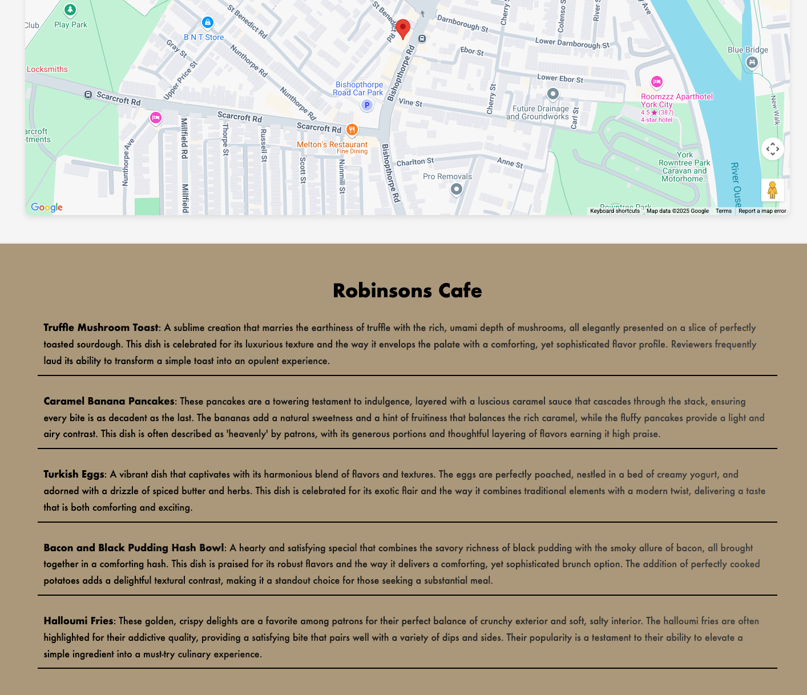

  

 
A restaurant dish recommendation engine using retrieval-augmented generation (RAG) to extract insights from Google Maps reviews.

## Description

Grains provides intelligent dish recommendations by analyzing Google Maps restaurant reviews. The system uses retrieval-augmented generation (RAG) to surface dish recommendations based on real customer reviews, allowing the user to easily find the best dishes at any restaurant listed on Google Maps.

## Stack

- **Frontend**: React (with Vite), TypeScript
- **Backend**: Node.js, Express
- **Database**: PostgreSQL with pgvector extension for vector embeddings
- **AI Integration**: OpenAI API
- **Caching**: Redis
- **Validation**: Zod for standardized LLM output validation
- **Data Source**: Apify

## Prerequisites

Before setting up the project locally, ensure you have:

- Node.js and npm installed
- PostgreSQL installed
- Redis installed
- API keys for required services (see below Environment Setup)

## Environment Setup

### Backend (`.env` file in backend folder)

`PG_USER`=your_postgres_username  
`PG_PASSWORD`=your_postgres_password  
`APIFY_API_TOKEN`=your_apify_token  
`OPENAI_API_KEY`=your_openai_api_key

### Frontend (`.env` file in frontend folder)

`VITE_GOOGLE_MAPS_API_KEY`=your_google_maps_api_key  
`VITE_GOOGLE_MAPS_MAP_ID`=optional_custom_map_id

## Installation

### Step 1: Clone the repository

`git clone https://github.com/LiamTurner347/grains.git`  
`cd grains`

### Step 2: Install backend dependencies

`cd backend`  
`npm install`

### Step 3: Install frontend dependencies

`cd ../frontend`  
`npm install`

### Step 4: Run the Application

#### a. Start the backend server

`cd backend`  
`npm run dev`

#### b. Start the frontend application

`cd frontend`  
`npm run dev`

### Step 5: Access the application

- At `http://localhost:5173` (or the port specified by Vite)

## How It Works

### User Flow

1. The UI loads with a Google Maps panel (initially centered on Bishopthorpe Road, York, United Kingdom, unless configured otherwise). It should look something like this...

  

2. Users can search for restaurants using the Google Maps search with autocomplete functionality

  

3. Upon selecting a restaurant, users can click to discover the best dishes at that restaurant

  

4. Results are displayed based on analysis of actual customer reviews

  

Note: The process of connecting to Apify, downloading recent reviews, embedding those reviews, curating the most relevant reviews, providing those reviews and a prompt as context to OpenAI's Chat Completions API, validating the response received from OpenAI and then formatting and displaying that response in the UI can take some time. Loading messages are displayed in the UI to let the user know that these computations are happening behind the scenes.

A Redis cache has been deployed to ensure that, where a user has searched for a restaurant's best dishes recently, the best dishes are cached and can be displayed instantly on future searches for that restaurant. This also prevents expensive and unnecessary recomputation.

### Backend Process Flow

#### 1. Express Route Handler

- `GET` request to `/restaurants/:name/:id/best-dishes`
- Parameters: `name` (restaurant name) and `placeID` (Google Maps Place ID)

#### 2. Cache Check Process

- Redis connection established
- Checks for cached data using restaurant name as key
- If valid cached data exists, returns it immediately

This step prevents unnecessary recomputations and ensure dishes are rendered instantly when the user searches for the same restaurant again (until the Redis server is restarted).

#### 3. Review Processing (On Cache Miss)

- Checks if restaurant exists in PostgreSQL database
- If not found, fetches up to 150 Google Maps restaurant reviews via Apify (from 2023-01-01 onwards only, and sorted by newest)
- Stores restaurant data in PostgreSQL
- Generates embeddings for reviews using OpenAI's `text-embedding-3-small` model
- Stores review embeddings in the database

#### 4. Context Generation

Performs vector similarity search (using cosine similarity) to find the 50 reviews most likely to provide information as to the restaurant's best dishes. This works by creating a 'food-focused review' reference vector and then using PostgreSQL's cosine similarity operator to find the 50 reviews most similar to this reference vector.

#### 5. Best Dishes Analysis

- Constructs a detailed prompt for GPT-4. This prompt is provided together with the 50 most relevant reviews as context.
- Uses OpenAI's `gpt-4o-2024-08-06` model with temperature 0.4
- Uses Zod for structured output validation. This ensures that the model provides output matching `BestDishesSchema` (array of objects with dish names and descriptions) which can then be easily formatted and displayed on the UI.
- Returns parsed results with dish names and descriptions

#### 6. Result Caching

- Stores results in Redis for future requests
- Returns data to client

## API Endpoints

`GET /restaurants/:name/:id/best-dishes` - Get recommended dishes for a specific restaurant
